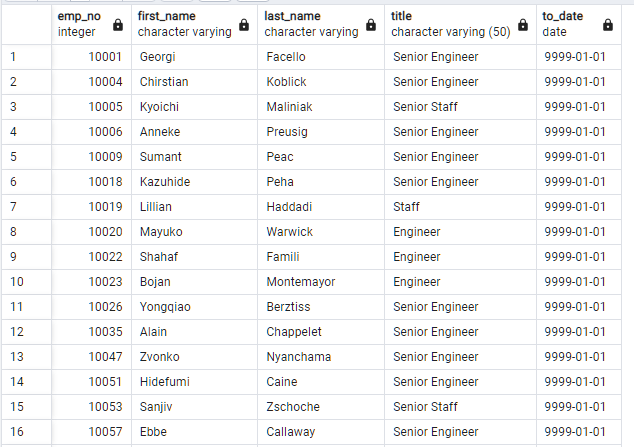
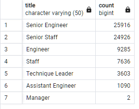
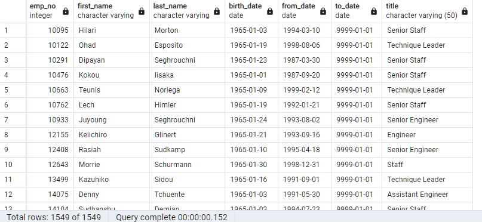

# Pewlett-Hackard-Analysis

## Overview

#### Purpose 
Prepare for the upcoming "silver tsunami" by analyzing data from Pewlett Hackard employee database.

#### Resources 
* PostgreSQL

## Results

Most Recent Titles: Shows the most recent job titles of employees who are about to retire.

Retiring Titles: Provides count of employees by their most recent job title who are about to retire.

## Summary

* "Silver tsunami" is expected to have a significant impact on Pewlett Hackard with potential vacancies in various roles.
* Potential shortage of retirement-ready employees for mentorship and training of next generation.

* Additional queries: Succession Planning and Skills Gap Analysis for further insights.

These findings can help Pewlett Hackard in understanding the impact of the "silver tsunami" and formulate strategies to address potential challenges and opportunities associated with the retiring workforce.